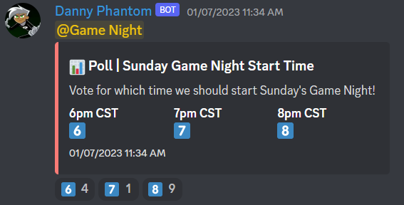

# 📊 Polls

Polls are a simple yet necessary feature for many guilds, which is why I have decided to simplify the process of creating one!

Using this command you can easily create customized Polls for your guild members to react.

Here is an example of one:

Using these polls are simple, just run the command

`/poll Title description option1 option2`

these are the only required fields, however it gets more complicated, the more fields you decide to use!

Options 1-10 are simply just that, options for the poll. These will be the choices that a user can react to.

#### 😁 Emojis Option

If you'd like to use different emojis from the default 1️⃣-🔟
use the "emojis" option in the command.
Make sure to use 1 emoji for each option, and separate them by commas.
In the end it should be something like
`🚀,🕝,📊`

### Chanel Option

This uses channels in the guild, good for testing purposes or to just send the poll to any channel besides the default-channel.

### Mention option

This just takes in a role/user, once the Poll is posted it will ping that role or user.

#### Finished command

Here is what a finished command can end up looking like

And here is the embed that gets posted!

