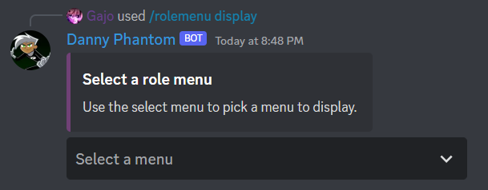
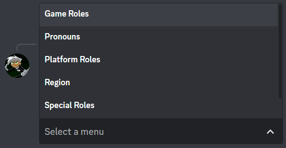
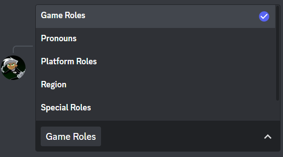
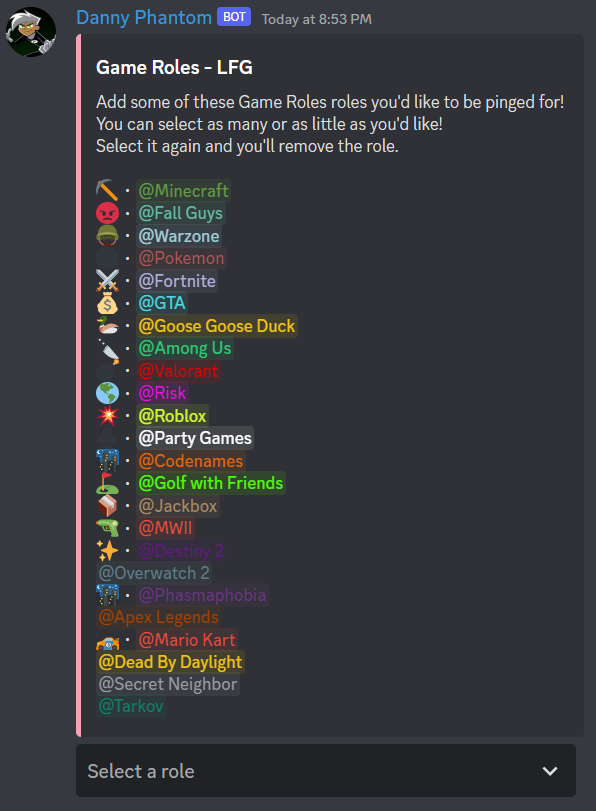
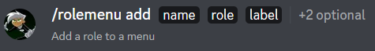

# 🍔 Role Menu

Here we have two guides, one for [Displaying Role Menus](#displaying-role-menus)

And another guide for [Adding Roles to Role Menus](#adding-roles-to-menus)

## Displaying Role Menus

Displaying role menu's is simple. In order to display a Role Menu, simply use the command `/rolemenu display`

Once you've run this command a Select Menu will show up.

Here you can see all of your Role Menu's and pick which one's you'd like to get posted **in that channel**.

Clicking on the Select Menu will also show you their <a id="displayName">**Display Names**</a> - remember this, it's important.

Just click the menu's you want to displayed, and click outside of the menu for the Role Menu to post.

Once that's done your menu is automatically posted in that channel!

## Adding Roles to Menus

In order to add roles to menus, we use the `/rolemenu add` command.

The `name` option take in the **[Display Name](#displayName)** of the menu.  

The `roles` option is self-explanatory, takes in a role.

The `label` can be anything. It's what the user will see when they select a role using the Select Menu

There are two more options which aren't required, but are useful.

The `emoji` option, just gives an emoji to associate with the role. This will only show in the embed and Select Menu

The `description` option, is just a short description that will be shown in the Select Menu for that specific role.