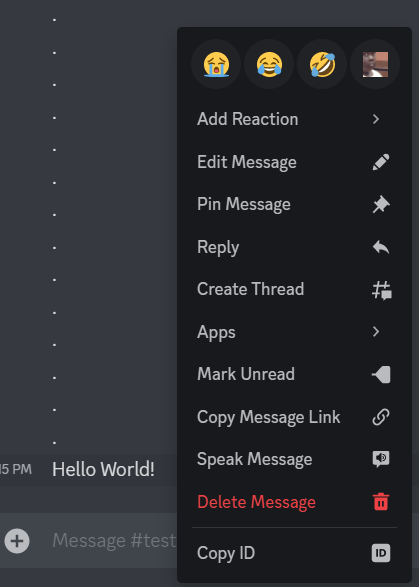
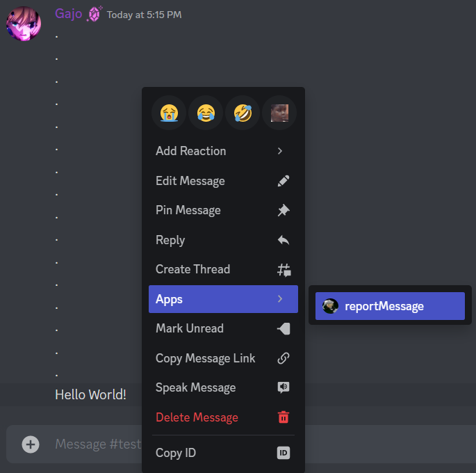
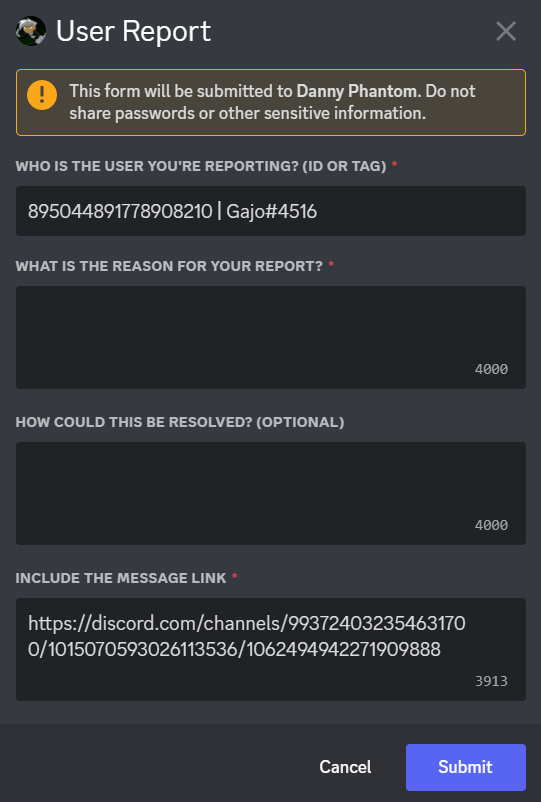

#  🚀 Context Reporting
Context reporting utilizes discord's **context menus** and **modals** in order to report a user (usually to staff).

# ❓ How to use 
Using a context report is extremely simple! Although it's sort of a hidden feature, as it's not commonly used.

In order to use context report here is a step-by-step guide for various platforms.

## 🖥️ Desktop (Windows & Mac)
### Step 1
Right click the message you'd like to report and a menu should pop up, this is the **Context Menu**

### Step 2
Hover over "Apps" and click "reportMessage"

### Step 3
Automatically a **Modal** (or form) should show up.

As you can see, the user you're reporting and the Message Link are already filled out for you. Leave this information there as it's important for the staff to see!
Fill out the rest of the information and you're all set, just click Submit, and staff will be notified.